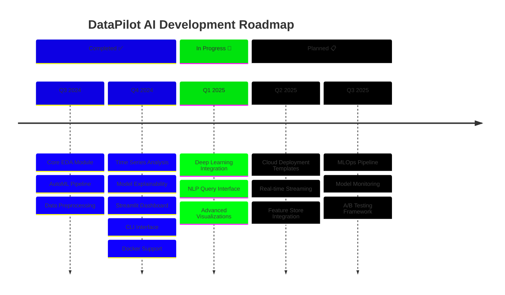

<!-- ============================================ -->
<!-- 🧠 DATAPILOT AI - STUNNING README           -->
<!-- ============================================ -->

<div align="center">

<!-- Animated SVG Header -->


<!-- Typing Animation Effect -->
<a href="https://git.io/typing-svg"></a>

<br/>

<!-- Animated Badges Row 1 - Main Info -->
<p>
  <a href="https://github.com/VivekGhantiwala/DataPilot-AI/releases"></a>
  <a href="LICENSE"></a>
  <a href="https://www.python.org/"></a>
  <a href="#"></a>
</p>

<!-- Animated Badges Row 2 - Stats -->
<p>
  <a href="https://github.com/VivekGhantiwala/DataPilot-AI/stargazers"></a>
  <a href="https://github.com/VivekGhantiwala/DataPilot-AI/network/members"></a>
  <a href="https://github.com/VivekGhantiwala/DataPilot-AI/issues"></a>
  <a href="https://github.com/VivekGhantiwala/DataPilot-AI/pulls"></a>
</p>

<!-- Code Quality Badges -->
<p>
  
  
  
  
  
</p>

<!-- Social/Platform Badges -->
<p>
  <a href="#"></a>
  <a href="#"></a>
  <a href="#"></a>
</p>

<br/>

<!-- Gradient Divider -->


</div>

<!-- ============================================ -->
<!-- 📑 ANIMATED TABLE OF CONTENTS               -->
<!-- ============================================ -->

<details open>
<summary><h2>📑 Table of Contents</h2></summary>

<div align="center">

| 🎯 | Section | 📝 | Section |
|:--:|:--------|:--:|:--------|
| 🌟 | [Overview](#-overview) | 🧹 | [Preprocessing](#-data-preprocessing) |
| ✨ | [Features](#-features) | 🧠 | [AI Insights](#-ai-powered-insights) |
| 🏗️ | [Architecture](#%EF%B8%8F-architecture) | 📊 | [Visualizations](#-visualization-gallery) |
| 🚀 | [Quick Start](#-quick-start) | 🐳 | [Docker](#-docker-deployment) |
| 📖 | [Documentation](#-documentation) | 🗺️ | [Roadmap](#%EF%B8%8F-roadmap) |
| 🤖 | [AutoML](#-automl-pipeline) | 🤝 | [Contributing](#-contributing) |
| 📈 | [Time Series](#-time-series-analysis) | ❓ | [FAQ](#-frequently-asked-questions) |
| 🔮 | [Explainability](#-model-explainability) | 💖 | [Support](#-support--sponsorship) |

</div>

</details>

<br/>

<!-- Gradient Divider -->


<!-- ============================================ -->
<!-- 🌟 OVERVIEW SECTION                         -->
<!-- ============================================ -->

## 🌟 Overview

<div align="center">

<table>
<tr>
<td width="60%">

### 🎯 What is DataPilot AI?

**DataPilot AI** is a comprehensive, production-ready data science framework that transforms how you work with data. It combines the power of automated machine learning, explainable AI, and intelligent insights into one seamless toolkit.

> *"From raw data to actionable insights in minutes, not hours."*

Whether you're a **data scientist** seeking to accelerate workflows, a **business analyst** needing quick insights, or a **developer** integrating ML into applications — DataPilot AI has you covered.

</td>
<td width="40%">


**10+ ML Algorithms** • **Auto Preprocessing**  
**SHAP & LIME** • **Time Series Forecasting**  
**Interactive Dashboard** • **One-Click Reports**

</td>
</tr>
</table>

</div>

### 🎪 Key Highlights

<div align="center">

```
┌─────────────────────────────────────────────────────────────────────────────────┐
│                                                                                 │
│   🔥 ZERO-CONFIG AUTOML        📊 BEAUTIFUL VISUALIZATIONS    🧠 AI INSIGHTS   │
│   Train 10+ models with        Publication-ready charts       Smart pattern    │
│   one line of code             with Plotly & Seaborn          detection        │
│                                                                                 │
│   ⚡ BLAZING FAST              🔍 EXPLAINABLE AI              🌐 WEB DASHBOARD │
│   Optimized algorithms         SHAP & LIME built-in          Streamlit UI      │
│   with XGBoost & LightGBM      for model transparency        no coding needed  │
│                                                                                 │
└─────────────────────────────────────────────────────────────────────────────────┘
```

</div>

<br/>

<!-- Gradient Divider -->


<!-- ============================================ -->
<!-- ✨ FEATURES SECTION WITH CARDS              -->
<!-- ============================================ -->

## ✨ Features

<div align="center">

<!-- Feature Cards Row 1 -->
<table>
<tr>
<td align="center" width="33%">

### 🔍 Exploratory Data Analysis


**Automated Statistical Analysis**

- 📊 Distribution & outlier detection
- 🔗 Correlation heatmaps
- 📈 Missing value analysis
- 📋 Data quality profiling
- 🎯 Target variable insights

</td>
<td align="center" width="33%">

### 🤖 AutoML Pipeline


**Zero-Config Model Training**

- ⚡ 10+ ML algorithms
- 🎛️ Hyperparameter tuning
- 📊 Model leaderboard
- 💾 One-click export
- 🔄 Cross-validation

</td>
<td align="center" width="33%">

### 📈 Time Series


**Forecasting & Analysis**

- 📉 Trend decomposition
- 🔮 ARIMA/Prophet/ETS
- ⚠️ Anomaly detection
- 📅 Seasonality analysis
- 📊 Confidence intervals

</td>
</tr>
</table>

<!-- Feature Cards Row 2 -->
<table>
<tr>
<td align="center" width="33%">

### 🔮 Model Explainability


**Transparent ML Decisions**

- 🎯 SHAP value analysis
- 🍋 LIME explanations
- 📊 Feature importance
- 📈 Partial dependence
- 🔍 Individual predictions

</td>
<td align="center" width="33%">

### 🧹 Data Preprocessing


**Smart Data Cleaning**

- 🔧 Missing value imputation
- 📏 Feature scaling
- 🏷️ Categorical encoding
- 🎯 Outlier treatment
- ⚖️ Class balancing

</td>
<td align="center" width="33%">

### 🧠 AI Insights


**Intelligent Recommendations**

- 🔍 Pattern detection
- ⚠️ Quality issue alerts
- 💡 Feature suggestions
- 📝 Auto report generation
- 🎯 Actionable insights

</td>
</tr>
</table>

</div>

<br/>

<!-- Gradient Divider -->


<!-- ============================================ -->
<!-- 🛠️ TECH STACK SECTION                       -->
<!-- ============================================ -->

## 🛠️ Tech Stack

<div align="center">

<!-- Core Technologies -->
<h3>🔧 Core Technologies</h3>
<p>
  
  
  
  
</p>

<!-- ML & AI -->
<h3>🤖 Machine Learning & AI</h3>
<p>
  
  
  
  
</p>

<!-- Visualization -->
<h3>📊 Visualization</h3>
<p>
  
  
  
</p>

<!-- Web & DevOps -->
<h3>🌐 Web & DevOps</h3>
<p>
  
  
  
</p>

<!-- Explainability -->
<h3>🔍 Explainability</h3>
<p>
  
  
  
</p>

</div>

<br/>

<!-- Gradient Divider -->


<!-- ============================================ -->
<!-- 🏗️ ARCHITECTURE DIAGRAM                     -->
<!-- ============================================ -->

## 🏗️ Architecture

```mermaid
graph TB
    subgraph Input["📥 Data Input"]
        CSV[("📄 CSV")]
        Excel[("📊 Excel")]
        Parquet[("🗃️ Parquet")]
    end

    subgraph Core["🧠 DataPilot AI Core"]
        direction TB
        
        subgraph Preprocessing["🧹 Preprocessing"]
            MV["Missing Values"]
            OD["Outlier Detection"]
            FE["Feature Encoding"]
            SC["Scaling"]
        end
        
        subgraph Analysis["📊 Analysis"]
            EDA["Exploratory Analysis"]
            TS["Time Series"]
            AI["AI Insights"]
        end
        
        subgraph ML["🤖 Machine Learning"]
            AutoML["AutoML Pipeline"]
            Models["10+ Algorithms"]
            Tuning["Hyperparameter Tuning"]
        end
        
        subgraph XAI["🔮 Explainability"]
            SHAP["SHAP Values"]
            LIME["LIME"]
            FI["Feature Importance"]
        end
    end

    subgraph Output["📤 Output"]
        Dashboard["🎨 Streamlit Dashboard"]
        Reports["📝 HTML Reports"]
        API["⚡ Python API"]
        CLI["💻 CLI"]
    end

    Input --> Core
    Core --> Output
    
    style Core fill:#1a1a2e,stroke:#6C63FF,stroke-width:3px
    style Input fill:#16213e,stroke:#00C853,stroke-width:2px
    style Output fill:#16213e,stroke:#FF6B6B,stroke-width:2px
```

<div align="center">



</div>

### 📁 Project Structure

```
📦 DataPilot-AI/
│
├── 🧠 src/                           # Core library modules
│   ├── __init__.py                   # Package exports
│   ├── ai_insights.py                # 🧠 AI-powered insights engine
│   ├── automl.py                     # 🤖 Automated machine learning
│   ├── data_preprocessing.py         # 🧹 Data cleaning & transformation
│   ├── eda.py                        # 📊 Exploratory data analysis
│   ├── explainability.py             # 🔮 SHAP & LIME integrations
│   ├── ml_models.py                  # 📈 ML model training (1200+ lines)
│   ├── time_series.py                # ⏰ Time series forecasting
│   ├── visualization.py              # 🎨 Data visualization utilities
│   ├── report_generator.py           # 📝 Automated report generation
│   └── data_generator.py             # 🎲 Synthetic data generation
│
├── 🎨 dashboard/
│   └── app.py                        # 🌐 Streamlit web interface (550+ lines)
│
├── 🧪 tests/                         # Test suite
│   ├── test_automl.py
│   ├── test_eda.py
│   └── test_preprocessing.py
│
├── 📊 data/
│   └── sample_data.csv               # Sample dataset
│
├── ⚙️ Configuration Files
│   ├── pyproject.toml                # Modern Python config
│   ├── requirements.txt              # Dependencies
│   ├── setup.py                      # Package setup
│   ├── Dockerfile                    # Container config
│   └── .github/workflows/ci.yml      # CI/CD pipeline
│
├── 📚 Documentation
│   ├── README.md                     # You are here! 📍
│   ├── CONTRIBUTING.md               # Contribution guide
│   ├── CHANGELOG.md                  # Version history
│   ├── CODE_OF_CONDUCT.md            # Community guidelines
│   └── SECURITY.md                   # Security policy
│
└── 💻 cli.py                         # Command-line interface
```

<br/>

<!-- Gradient Divider -->


<!-- ============================================ -->
<!-- 🚀 QUICK START SECTION                      -->
<!-- ============================================ -->

## 🚀 Quick Start

<div align="center">

### ⚡ Get up and running in under 2 minutes!

</div>

### Prerequisites

| Requirement | Version | Notes |
|:-----------:|:-------:|:------|
| 🐍 Python | 3.9+ | 3.11 recommended |
| 📦 pip | Latest | Package manager |
| 🔧 Git | Any | For cloning |

### Installation Options

<details open>
<summary><h4>🎯 Option 1: Quick Install (Recommended)</h4></summary>

```bash
# Clone the repository
git clone https://github.com/VivekGhantiwala/DataPilot-AI.git
cd DataPilot-AI

# Create virtual environment
python -m venv venv
source venv/bin/activate  # Windows: venv\Scripts\activate

# Install package
pip install -e .
```

</details>

<details>
<summary><h4>📦 Option 2: Dependencies Only</h4></summary>

```bash
# Clone and install
git clone https://github.com/VivekGhantiwala/DataPilot-AI.git
cd DataPilot-AI

pip install -r requirements.txt
```

</details>

<details>
<summary><h4>🐳 Option 3: Docker</h4></summary>

```bash
# Build image
docker build -t datapilot-ai .

# Run container
docker run -p 8501:8501 datapilot-ai
```

</details>

<details>
<summary><h4>⚙️ Option 4: With Extras</h4></summary>

```bash
# Install with all optional dependencies
pip install -e ".[all]"

# Or specific extras
pip install -e ".[dev]"      # Development tools
pip install -e ".[ml]"       # Extra ML libraries
pip install -e ".[dashboard]" # Dashboard dependencies
```

</details>

### ✅ Verify Installation

```bash
# Check CLI
python cli.py --help

# Run tests
pytest tests/ -v

# Launch dashboard
python cli.py dashboard
```

<div align="center">

### 🎉 You're ready to go!

</div>

<br/>

<!-- Gradient Divider -->


<!-- ============================================ -->
<!-- 📖 DOCUMENTATION SECTION                    -->
<!-- ============================================ -->

## 📖 Documentation

<div align="center">

### Choose Your Path

| 🎨 **No Code** | ⌨️ **CLI** | 🐍 **Python API** |
|:-------------:|:----------:|:-----------------:|
| Interactive Dashboard | Command Line | Full Programmatic Control |
| Upload & Click | Script Automation | Custom Workflows |
| Visual Results | Pipeline Integration | Production Ready |

</div>

---

### 🎨 Interactive Dashboard

Launch the beautiful Streamlit dashboard for a **zero-code** experience:

```bash
# Using CLI
python cli.py dashboard

# Or directly
streamlit run dashboard/app.py
```

Then open **http://localhost:8501** in your browser.

<div align="center">

**Dashboard Features:**
📊 Data Overview • 📈 EDA • 🔧 Preprocessing • 🤖 ML Training • 🧠 AI Insights • 📥 Export

</div>

---

### ⌨️ Command Line Interface

```bash
# 📊 Exploratory Data Analysis
python cli.py analyze -i data.csv -t target_column -o report.txt

# 🤖 AutoML Training
python cli.py automl -i data.csv -t target --task classification --max-models 10

# 📈 Time Series Forecasting
python cli.py timeseries -i sales.csv --date-column date --value-column sales -f 30

# 🧹 Data Preprocessing
python cli.py preprocess -i raw.csv -o clean.csv --scale --encode

# 📝 Generate Report
python cli.py report -i data.csv -o report.html --title "Analysis Report"
```

---

### 🐍 Python API Examples

<details open>
<summary><h4>🤖 AutoML Pipeline</h4></summary>

```python
from src import AutoML
import pandas as pd

# Load your data
data = pd.read_csv("your_data.csv")
X = data.drop(columns=["target"])
y = data["target"]

# Initialize AutoML - it's that simple! 🚀
automl = AutoML(
    task="classification",  # or "regression", "auto"
    max_models=10,          # Number of models to try
    cv_folds=5              # Cross-validation folds
)

# Train all models
automl.fit(X, y)

# View results
print(automl.get_leaderboard())
print(automl.summary())

# Make predictions
predictions = automl.predict(X_new)

# Save best model
automl.save("best_model.pkl")
```

**Output:**
```
╔═══════════════════════════════════════════════════════════════════╗
║                        🏆 Model Leaderboard                        ║
╚═══════════════════════════════════════════════════════════════════╝

 Rank │ Model               │ Accuracy │ F1 Score │ ROC-AUC │ Time(s)
──────┼─────────────────────┼──────────┼──────────┼─────────┼─────────
  1   │ XGBoost             │  0.9421  │  0.9385  │  0.9712 │   2.3
  2   │ LightGBM            │  0.9398  │  0.9362  │  0.9689 │   1.1
  3   │ Random Forest       │  0.9356  │  0.9318  │  0.9645 │   4.7
```

</details>

<details>
<summary><h4>📊 Exploratory Data Analysis</h4></summary>

```python
from src import ExploratoryAnalysis
import pandas as pd

# Load data
data = pd.read_csv("your_data.csv")

# Run comprehensive EDA
eda = ExploratoryAnalysis(data)
eda.print_report()

# Get specific insights
correlations = eda.correlation_analysis()
missing = eda.missing_value_analysis()
outliers = eda.detect_outliers_summary()
stats = eda.get_statistics()
```

</details>

<details>
<summary><h4>📈 Time Series Forecasting</h4></summary>

```python
from src import TimeSeriesAnalyzer
import pandas as pd

# Load time series data
data = pd.read_csv("sales_data.csv")

# Initialize analyzer
ts = TimeSeriesAnalyzer(
    data=data,
    date_column="date",
    value_column="sales"
)

# Run analysis
ts.analyze()

# Generate 30-day forecast
forecast = ts.forecast(periods=30, method="auto")

# Visualize results
ts.plot_forecast(forecast)

# Get detailed report
print(ts.generate_report())
```

</details>

<details>
<summary><h4>🔮 Model Explainability</h4></summary>

```python
from src import ModelExplainer
from sklearn.ensemble import RandomForestClassifier

# Train your model
model = RandomForestClassifier()
model.fit(X_train, y_train)

# Create explainer
explainer = ModelExplainer(
    model=model,
    X_train=X_train,
    feature_names=X_train.columns.tolist(),
    task="classification"
)

# Explain a single prediction
explanation = explainer.explain_prediction(X_test.iloc[0])

# SHAP summary plot
explainer.plot_shap_summary(X_test)

# Feature importance
importance = explainer.get_feature_importance()

# Generate report
report = explainer.generate_report(X_test)
```

</details>

<details>
<summary><h4>🧹 Data Preprocessing</h4></summary>

```python
from src import DataPreprocessor

# Initialize preprocessor
prep = DataPreprocessor()

# Load data
prep.load_data("raw_data.csv")

# Full pipeline (one-liner!)
clean_data = prep.preprocess_pipeline(
    handle_missing=True,
    remove_dups=True,
    handle_outliers_flag=True,
    scale=True,
    encode=True
)

# Or step-by-step with full control
prep.handle_missing_values(strategy="auto")
prep.remove_duplicates()
prep.handle_outliers(method="clip")  # or "iqr", "zscore"
prep.scale_features(method="standard")  # or "minmax", "robust"
prep.encode_categorical(method="onehot")  # or "label"
```

</details>

<details>
<summary><h4>🧠 AI-Powered Insights</h4></summary>

```python
from src import AIInsights
import pandas as pd

data = pd.read_csv("your_data.csv")

# Initialize AI insights engine
ai = AIInsights(data)

# Generate automated report
report = ai.generate_automated_report(target_column="target")
print(report)

# Detect data quality issues
issues = ai.detect_data_quality_issues()

# Get smart recommendations
recommendations = ai.generate_recommendations(task_type="classification")

# Quick insights summary
quick = ai.get_quick_insights()
```

</details>

<br/>

<!-- Gradient Divider -->


<!-- ============================================ -->
<!-- 🤖 AUTOML DETAILS                           -->
<!-- ============================================ -->

## 🤖 AutoML Pipeline

<div align="center">

### Supported Algorithms

</div>

<table>
<tr>
<td width="50%">

### 📊 Classification

| Algorithm | Library | Strength |
|:----------|:--------|:---------|
| 🌲 Random Forest | scikit-learn | Robust baseline |
| 🚀 XGBoost | xgboost | High performance |
| ⚡ LightGBM | lightgbm | Fast training |
| 🐱 CatBoost | catboost | Categorical data |
| 📈 Logistic Regression | scikit-learn | Interpretable |
| 🎯 SVM | scikit-learn | High dimensions |
| 🏠 K-Nearest Neighbors | scikit-learn | Non-parametric |
| 🌳 Decision Tree | scikit-learn | Explainable |
| 🔄 AdaBoost | scikit-learn | Adaptive |
| 🌿 Extra Trees | scikit-learn | Variance reduction |

</td>
<td width="50%">

### 📈 Regression

| Algorithm | Library | Strength |
|:----------|:--------|:---------|
| 📏 Linear Regression | scikit-learn | Simple baseline |
| 🎚️ Ridge/Lasso | scikit-learn | Regularized |
| 🌲 Random Forest | scikit-learn | Non-linear |
| 🚀 XGBoost | xgboost | High performance |
| ⚡ LightGBM | lightgbm | Large datasets |
| 🔗 ElasticNet | scikit-learn | L1+L2 |
| 🎯 SVR | scikit-learn | Kernel methods |
| 📊 Gradient Boosting | scikit-learn | Sequential |

</td>
</tr>
</table>

<div align="center">

### ⏰ Time Series Algorithms

| Method | Library | Best For |
|:-------|:--------|:---------|
| 📈 ARIMA | statsmodels | Non-seasonal data |
| 🔄 SARIMA | statsmodels | Seasonal patterns |
| 📊 Exponential Smoothing | statsmodels | Trend + seasonality |
| 🔮 Prophet | prophet | Business forecasts |

</div>

<br/>

<!-- Gradient Divider -->


<!-- ============================================ -->
<!-- 📊 VISUALIZATION GALLERY                    -->
<!-- ============================================ -->

## 📊 Visualization Gallery

<div align="center">

### Sample Outputs

```
┌────────────────────────────────────────────────────────────────────────────┐
│                                                                            │
│   ╔════════════════════════════════════════════════════════════════════╗   │
│   ║               📊 EXPLORATORY DATA ANALYSIS REPORT                  ║   │
│   ╚════════════════════════════════════════════════════════════════════╝   │
│                                                                            │
│   📌 Dataset Overview                                                      │
│   ━━━━━━━━━━━━━━━━━━━━━━━━━━━━━━━━━━━━━━━━━━━━━━━━━━━━━━━━━━━━━━━━━━━━━━   │
│   • Total Rows: 10,000                                                     │
│   • Total Columns: 25                                                      │
│   • Memory Usage: 2.4 MB                                                   │
│   • Numerical Columns: 18                                                  │
│   • Categorical Columns: 7                                                 │
│                                                                            │
│   📈 Missing Values Analysis                                               │
│   ━━━━━━━━━━━━━━━━━━━━━━━━━━━━━━━━━━━━━━━━━━━━━━━━━━━━━━━━━━━━━━━━━━━━━━   │
│   • income: 5.0% missing                                                   │
│   • credit_score: 3.0% missing                                             │
│                                                                            │
│   🔗 Top Correlations                                                      │
│   ━━━━━━━━━━━━━━━━━━━━━━━━━━━━━━━━━━━━━━━━━━━━━━━━━━━━━━━━━━━━━━━━━━━━━━   │
│   • income ↔ savings: 0.89                                                 │
│   • age ↔ years_employed: 0.76                                             │
│                                                                            │
└────────────────────────────────────────────────────────────────────────────┘
```

### Available Visualizations

| Type | Description | Method |
|:-----|:------------|:-------|
| 📊 Distribution | Histograms with KDE | `plot_distribution()` |
| 📈 Box Plots | Outlier visualization | `plot_boxplot()` |
| 🔥 Heatmaps | Correlation matrices | `plot_correlation_heatmap()` |
| 🎯 Scatter | Relationship analysis | `plot_scatter()` |
| 📉 Time Series | Temporal patterns | `plot_time_series()` |
| 🏆 Feature Importance | Model insights | `plot_feature_importance()` |
| 🎨 Dashboard | Multi-plot overview | `create_dashboard()` |

</div>

<br/>

<!-- Gradient Divider -->


<!-- ============================================ -->
<!-- 🐳 DOCKER SECTION                           -->
<!-- ============================================ -->

## 🐳 Docker Deployment

<div align="center">

### 🚢 Deploy Anywhere with Docker

</div>

```bash
# Build the image
docker build -t datapilot-ai .

# Run with default settings
docker run -p 8501:8501 datapilot-ai

# Run with data volume
docker run -p 8501:8501 -v $(pwd)/data:/app/data datapilot-ai

# Run with environment variables
docker run -p 8501:8501 -e DEBUG=false datapilot-ai
```

### Docker Compose

```yaml
version: '3.8'
services:
  datapilot:
    build: .
    ports:
      - "8501:8501"
    volumes:
      - ./data:/app/data
    environment:
      - DEBUG=false
      - AUTOML_MAX_MODELS=10
```

<br/>

<!-- Gradient Divider -->


<!-- ============================================ -->
<!-- 🗺️ ROADMAP SECTION                          -->
<!-- ============================================ -->

## 🗺️ Roadmap

<div align="center">

### Development Progress

</div>



### Feature Status

| Feature | Status | Progress |
|:--------|:------:|:--------:|
| ✅ Core EDA | Complete |  |
| ✅ AutoML Pipeline | Complete |  |
| ✅ Time Series | Complete |  |
| ✅ Model Explainability | Complete |  |
| ✅ Streamlit Dashboard | Complete |  |
| ✅ CLI Interface | Complete |  |
| ✅ Docker Support | Complete |  |
| 🔄 Deep Learning | In Progress |  |
| 🔄 NLP Interface | In Progress |  |
| 📋 Cloud Templates | Planned |  |
| 📋 Real-time Analysis | Planned |  |
| 📋 MLOps Integration | Planned |  |

<br/>

<!-- Gradient Divider -->


<!-- ============================================ -->
<!-- 🤝 CONTRIBUTING SECTION                     -->
<!-- ============================================ -->

## 🤝 Contributing

<div align="center">

### We 💖 Contributors!

<a href="https://github.com/VivekGhantiwala/DataPilot-AI/graphs/contributors">
  
</a>

</div>

### Quick Start for Contributors

```bash
# 1. Fork and clone
git clone https://github.com/YOUR_USERNAME/DataPilot-AI.git
cd DataPilot-AI

# 2. Create feature branch
git checkout -b feature/amazing-feature

# 3. Install dev dependencies
pip install -e ".[dev]"

# 4. Make changes and test
pytest tests/ -v
black src/ tests/
flake8 src/ tests/

# 5. Commit with conventional commits
git commit -m "feat(automl): add amazing feature"

# 6. Push and create PR
git push origin feature/amazing-feature
```

### Contribution Types

| Type | Description | Label |
|:-----|:------------|:------|
| 🐛 Bug Fix | Fix existing issues | `bug` |
| ✨ Feature | New functionality | `enhancement` |
| 📚 Docs | Documentation improvements | `documentation` |
| 🧪 Tests | Add or improve tests | `testing` |
| 🎨 Style | Code style/formatting | `style` |
| ♻️ Refactor | Code improvements | `refactor` |

📖 **Read the full guide:** [CONTRIBUTING.md](CONTRIBUTING.md)

<br/>

<!-- Gradient Divider -->


<!-- ============================================ -->
<!-- ❓ FAQ SECTION                              -->
<!-- ============================================ -->

## ❓ Frequently Asked Questions

<details>
<summary><b>🤔 What makes DataPilot AI different from other AutoML tools?</b></summary>

DataPilot AI combines **AutoML**, **Explainable AI**, **Time Series**, and **AI Insights** in one unified toolkit. Unlike tools that focus on just model training, we provide end-to-end coverage from data exploration to model explanation.

</details>

<details>
<summary><b>🐍 What Python versions are supported?</b></summary>

We support **Python 3.9, 3.10, 3.11, and 3.12**. Python 3.11 is recommended for best performance.

</details>

<details>
<summary><b>💾 Can I use my own models with the explainability module?</b></summary>

Yes! The `ModelExplainer` class works with any scikit-learn compatible model. Just pass your trained model, and you'll get SHAP/LIME explanations instantly.

</details>

<details>
<summary><b>🌐 Can I deploy the dashboard to the cloud?</b></summary>

Absolutely! The Streamlit dashboard can be deployed to:
- **Streamlit Cloud** (free tier available)
- **Heroku**
- **AWS/GCP/Azure** with Docker
- Any platform supporting Docker containers

</details>

<details>
<summary><b>📊 What data formats are supported?</b></summary>

- **CSV** (`.csv`)
- **Excel** (`.xlsx`, `.xls`)
- **Parquet** (`.parquet`)
- **JSON** (`.json`)
- **Pandas DataFrames** (programmatic)

</details>

<details>
<summary><b>⚡ How fast is the AutoML pipeline?</b></summary>

Speed depends on data size and model count, but typical benchmarks:
- **1,000 rows, 10 models**: ~30 seconds
- **10,000 rows, 10 models**: ~2-5 minutes
- **100,000 rows, 10 models**: ~10-20 minutes

LightGBM and XGBoost are particularly optimized for speed.

</details>

<details>
<summary><b>🔧 Can I customize the preprocessing pipeline?</b></summary>

Yes! You can either use the one-liner `preprocess_pipeline()` or chain individual methods (`handle_missing_values()`, `scale_features()`, etc.) for full control.

</details>

<br/>

<!-- Gradient Divider -->


<!-- ============================================ -->
<!-- 💖 SUPPORT SECTION                          -->
<!-- ============================================ -->

## 💖 Support & Sponsorship

<div align="center">

### If DataPilot AI helps your work, consider supporting!

<br/>

<a href="https://github.com/VivekGhantiwala/DataPilot-AI/stargazers">
  
</a>
<a href="https://github.com/VivekGhantiwala/DataPilot-AI/fork">
  
</a>
<a href="https://github.com/sponsors/VivekGhantiwala">
  
</a>

<br/><br/>

### 📬 Get in Touch

<p>
  <a href="https://github.com/VivekGhantiwala/DataPilot-AI/issues"></a>
  <a href="https://github.com/VivekGhantiwala/DataPilot-AI/issues"></a>
  <a href="https://github.com/VivekGhantiwala/DataPilot-AI/discussions"></a>
</p>

<p>
  <a href="mailto:vivekghantiwala14@gmail.com"></a>
  <a href="https://github.com/VivekGhantiwala"></a>
</p>

</div>

<br/>

<!-- Gradient Divider -->


<!-- ============================================ -->
<!-- 📜 LICENSE SECTION                          -->
<!-- ============================================ -->

## 📜 License

<div align="center">

This project is licensed under the **MIT License** - see the [LICENSE](LICENSE) file for details.

```
MIT License

Copyright (c) 2024 DataPilot AI Contributors

Permission is hereby granted, free of charge, to any person obtaining a copy
of this software and associated documentation files (the "Software"), to deal
in the Software without restriction, including without limitation the rights
to use, copy, modify, merge, publish, distribute, sublicense, and/or sell
copies of the Software, and to permit persons to whom the Software is
furnished to do so, subject to the following conditions:
...
```

</div>

<br/>

<!-- Gradient Divider -->


<!-- ============================================ -->
<!-- 🙏 ACKNOWLEDGMENTS                          -->
<!-- ============================================ -->

## 🙏 Acknowledgments

<div align="center">

### Built with Amazing Open Source Projects

<p>
  
  
  
  
  
  
  
</p>

</div>

<br/>

<!-- ============================================ -->
<!-- FOOTER                                      -->
<!-- ============================================ -->

<div align="center">

<!-- Star History Chart -->
<a href="https://star-history.com/#VivekGhantiwala/DataPilot-AI&Date">
  <picture>
    <source media="(prefers-color-scheme: dark)" srcset="https://api.star-history.com/svg?repos=VivekGhantiwala/DataPilot-AI&type=Date&theme=dark" />
    <source media="(prefers-color-scheme: light)" srcset="https://api.star-history.com/svg?repos=VivekGhantiwala/DataPilot-AI&type=Date" />
    
  </picture>
</a>

<br/><br/>

<!-- Animated Footer -->


<br/>

### ⭐ Star this repo if you find it helpful!

<br/>

**Made with ❤️ by [Vivek Ghantiwala](https://github.com/VivekGhantiwala) and the DataPilot AI Community**

<br/>

<a href="#-datapilot-ai">
  
</a>

</div>

<!-- ============================================ -->
<!-- END OF README                               -->
<!-- ============================================ -->
